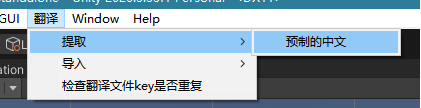
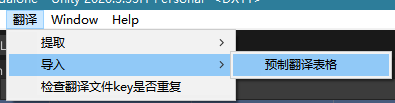

# TranslateProject
A Projects for multiple languages

### 提取预制的中文

在工具栏中选择：翻译-->提取-->预制的中文

1. 选择已经生成的翻译文件excel；
2. 提取ngui-lable的中文字段 ；
3. 提取ugui-uitext的中文字段；
4. 排除掉已经在excal中的中文key；
5. 将新的未翻译key添加在excel中；
6. 保存excel文件。

### 导入翻译

在工具栏中选择：翻译-->导入-->预制翻译表格

1. 选择已经生成的翻译文件excel；
2. 遍历所有的预制，查看是否生成过多语言预制
3. 找到多语言预制的lable，将当前词条的翻译，写入lable中；如果没有翻译，就不对这个预制进行修改；

### 检查翻译文件key是否重复

防止翻译提取重复

1. 选择已经生成的翻译文件excel；
2. 遍历所有行，如果有重复的key，会报错。
